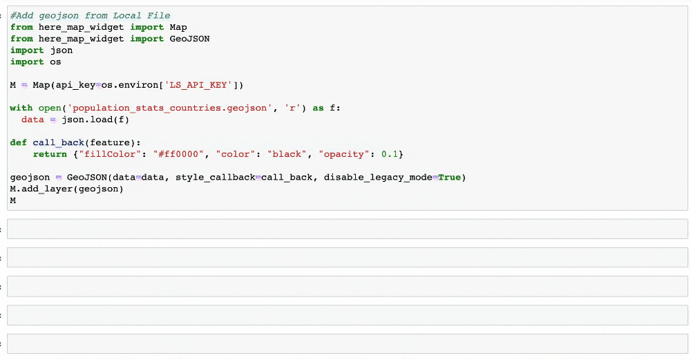
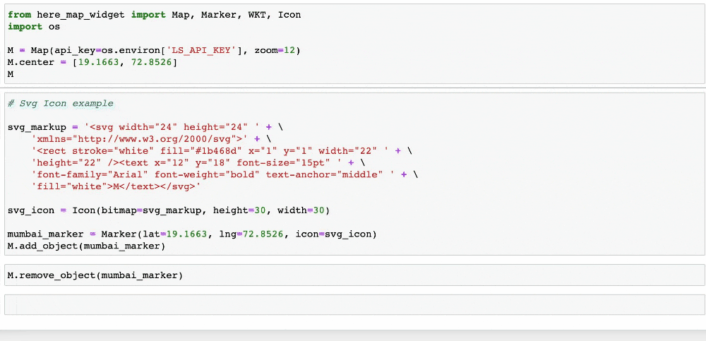
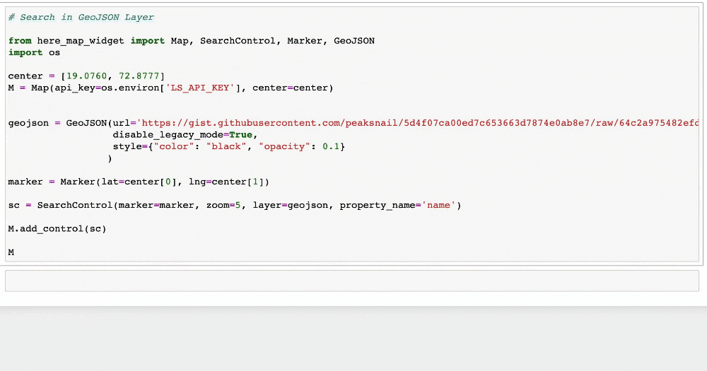
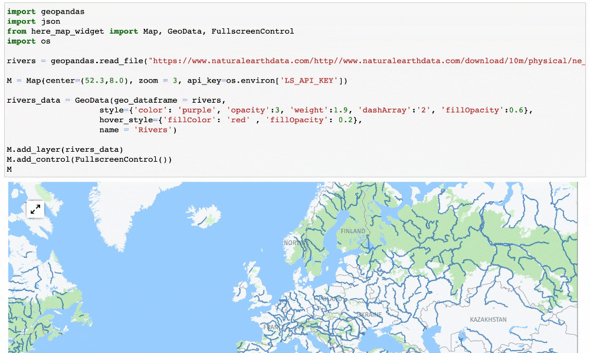
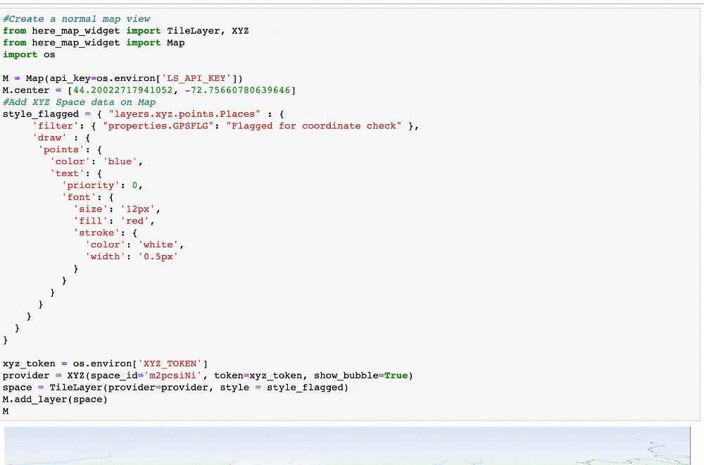
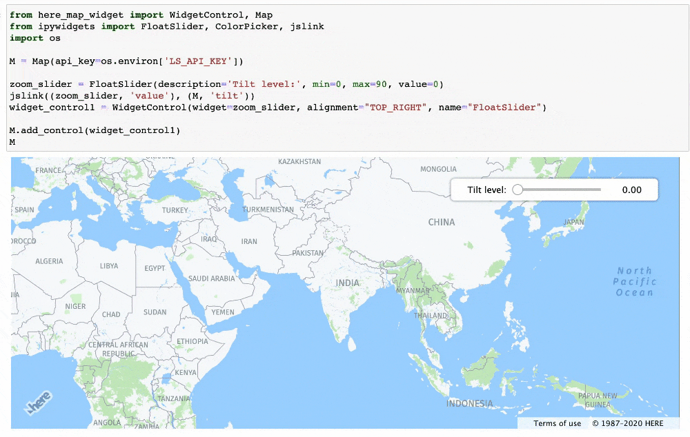

HERE Map Widget for Juptyer
===========================

Use [HERE Maps API for JavaScript](https://developer.here.com/develop/javascript-api) in your [Jupyter Notebook](https://jupyter.org/).

Usage
------------

**Selecting a basemap:**

**Loading a geojson data on map:**

**Making use of HERE Maps API for JavaScript primitives like Marker:**

**Using the search control to search geojson layer data:**

**Displaying geopandas data on map:**

**Displaying XYZ space data on map:**

**Use ipywidgets controls**

Installation
------------
To add npm registry:

    $ npm config set @here:registry https://repo.platform.here.com/artifactory/api/npm/here-node/
    
To install use pip:

    $ pip install here-map-widget-for-jupyter
    $ jupyter nbextension install --py --sys-prefix here_map_widget
    $ jupyter nbextension enable here_map_widget --py --sys-prefix

To install for jupyterlab

    $ jupyter labextension install @jupyter-widgets/jupyterlab-manager @here/map-widget-for-jupyter

For a development installation (requires npm),

    $ git clone https://github.com/heremaps/here-map-widget-for-jupyter.git
    $ cd here-map-widget-for-jupyter
    $ pip install -e .
    $ jupyter nbextension install --py --symlink --sys-prefix here_map_widget
    $ jupyter nbextension enable --py --sys-prefix here_map_widget
    $ jupyter labextension install @jupyter-widgets/jupyterlab-manager js

When actively developing your extension, build Jupyter Lab with the command:

    $ jupyter lab --watch

This take a minute or so to get started, but then allows you to hot-reload your javascript extension.
To see a change, save your javascript, watch the terminal for an update.

Note on first `jupyter lab --watch`, you may need to touch a file to get Jupyter Lab to open.

Documentation
-------------
For now documentation consists of sample notebooks in `examples` directory.

License
-------

Copyright (C) 2019-2020 HERE Europe B.V.

Unless otherwise noted in `LICENSE` files for specific directories, the [LICENSE](LICENSE) in the root applies to all content in this repository.

